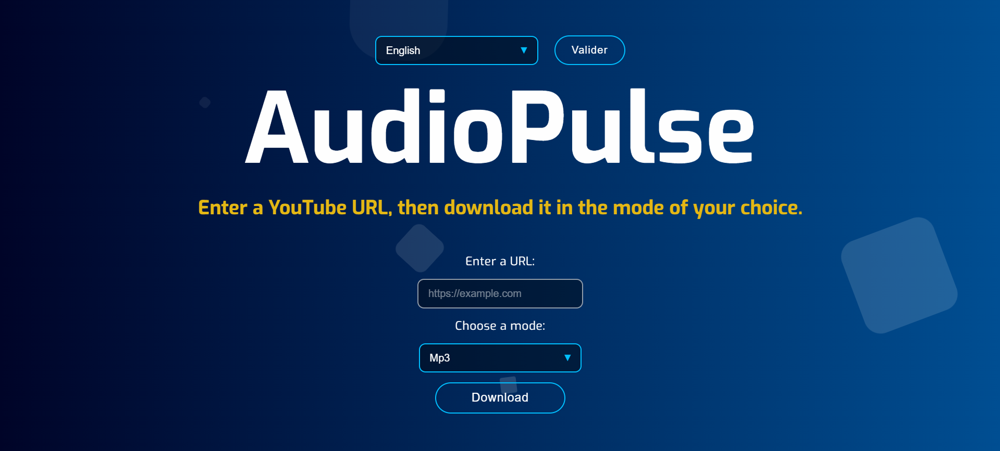

# 🎵 YouTube Downloader

Un **téléchargeur YouTube simple** développé avec **Python, Flask et Jinja2**.  
Cette application web permet de **télécharger des vidéos YouTube en MP4 ou MP3** directement depuis une interface web.

---

# 🚀 Aperçu

Une petite application web où l'utilisateur peut :

1. Coller un **lien YouTube**
2. Choisir le **format de téléchargement**
3. Télécharger la **vidéo ou l'audio**

---

## 🖼️ Interface

---

# 🛠️ Technologies utilisées

| Technologie | Description |
|-------------|-------------|
| Python | Langage principal |
| Flask | Framework web backend |
| Jinja2 | Moteur de templates |
| pytube / yt-dlp | Téléchargement des vidéos |
| HTML / CSS | Interface utilisateur |

---

# 🧑‍💻 Utilisation

1. Copier une **URL YouTube**
2. La coller dans le champ du site
3. Choisir **MP3** ou **MP4**
4. Cliquer sur **Download**

Le fichier sera téléchargé automatiquement.

---

# ⚠️ Disclaimer

Ce projet est développé uniquement à **des fins éducatives**.

Merci de respecter :

- les **droits d'auteur**
- les **conditions d'utilisation de YouTube**

---

# 📜 Licence

Projet open-source pour **apprentissage et expérimentation**.
